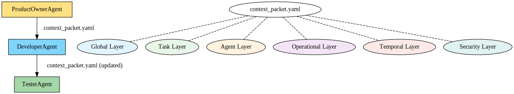

# MLCP v0.1.0 (Hybrid Alpha) · [](https://github.com/siddhu1997/MLCP/blob/main/LICENSE)

## 🚀 Overview
Muli-layered Contect Protocol (MLCP) is a protocol-driven system for managing layered, contextual data in AI-agent orchestration. Inspired by real-world agile teams, MLCP supports structured multi-agent collaboration with traceable, evolving context across sprints and tasks.

## 🎯 Aim

MLCP (Multi-Layered Context Protocol) aims to create a structured and extensible way for AI agents to collaborate by mimicking real-world software teams. By introducing layered context from immutable or slow-changing shared global truths to dynamic agent and task-specific information. MLCP aim to enable adaptive reasoning, traceability, and predictive orchestration.

The goal is to support a hybrid system: part simulation, part execution, where agents are not only spawned and reasoned over but also monitored, corrected, and improved through temporal feedback loops and human-in-the-loop interventions.

Ultimately, MLCP seeks to evolve into a framework that balances:
- **Machine efficiency** with **human empathy**
- **Scalability** with **traceability**
- **Agent autonomy** with **protocol-driven coordination**

## 🌐 Architecture
- **Global Layer**: Immutable truths and configurations.
- **Task Layer**: Represents work units and evolving task states.
- **Agent Layer**: Defines agent-specific context and capabilities.
- **Operational Layer**: Real-time execution states, resource limits.
- **Temporal Layer**: Sprint logs, historical context, and forecasting.
- **Security Layer**: Scoped access and redaction protocols.

## 🖼️ MLCP Architecture Diagram


## 🧬 Why Not MCP? Why It Feels Like MCP (But Isn’t)

At first glance, MLCP may resemble MCP (Model Context Protocol) due to the presence of layered or scoped contexts, and the ability to manage substructures of work. However, MLCP is fundamentally different in both its goals and design philosophy.

| Feature               | MCP (Model Context Protocol)  | MLCP (This Repo)                                                |
|----------------------|-------------------------------|------------------------------------------------------------------|
| 🧠 Purpose             | Inject context for a model's response | Drive agentic orchestration across roles and time               |
| 🧩 Context Handling    | Often static or JSON-based     | Structured, dynamic, and layered protocol with propagation rules |
| 🧠 Sub-agent Model     | Not a native concept           | Agents are first-class citizens hired per context and budget     |
| 🔁 Temporal Awareness  | Lacks intrinsic memory         | Native temporal layer with sprint logs and context evolution     |
| 📉 Token Control       | Managed externally             | Token usage and cost are part of orchestration logic             |
| 🔒 Security            | Flat or implicit               | Explicit scoped access per layer and agent role                 |
| 👤 Human-in-the-loop   | Not baked in                   | Designed for approvals, nudges, and traceable context shifts     |
| 🕸️ Coordination Model | Model pipeline or tool-chain   | Adaptive protocol for team-like agent collaboration             |

### 👥 Difference from “Sub-Agent” Concepts

While MCP systems may **simulate modularity** using nested contexts or chained model calls, MLCP introduces a more dynamic concept:

- **MCP sub-agents**, when present, are usually static functions or prompt injections — not autonomous or stateful entities.
- They inherit **no budget awareness**, cannot reason across time, and have no clear lifecycle outside model pipelines.

By contrast, **MLCP agents** are:
- **Spawned like hires**, based on role category, task need, and system budget.
- Given **scoped, layered context packets** relevant to their role.
- Able to **reason independently**, suggest protocol actions, and operate within execution bounds.
- Tracked across tasks/sprints via the **temporal layer** for observability and forecasting.

In essence, **MCP is for managing context per model**, while **MLCP is for managing context and coordination among many agents**, with layers that evolve over time — making it a broader and more system-oriented protocol.

## 🏗️ Layer Engineering

Each MLCP layer has specific engineering strategies, storage models, and access controls.  
See [docs/layers.md](./docs/layers.md) for the full breakdown.

## ⚙️ Key Components
- `context_manager/`: Orchestrates context updates and access.
- `agent_engine/`: Spawns agents, applies budgets, routes tasks.
- `temporal_layer/`: Tracks and forecasts context changes.
- `telemetry/`: Collects and analyses performance signals.
- `dashboard/`: Human-in-the-loop frontend (React/Next.js).
- `api/`: REST or gRPC interface.
- `config/`: Layer definitions and agent budget configurations.

## 📄 Protocol Schema

MLCP uses a layered YAML-based structure to define the communication packet shared across agents.

### [context_packet.yaml](./config/context_packet.yaml)
The core context model used by agents to reason, act, and pass along scoped context across MLCP layers. This file serves as the protocol reference for all inter-agent communication and is versioned alongside the protocol.

> Note: While `context_packet.yaml` is defined in YAML for readability and reference, the actual transmission format can be JSON (for RESTful communication) or Protocol Buffers (for high-performance agent communication).
>
> A serialization adapter layer will convert packets between YAML ↔ JSON ↔ Protobuf as needed, depending on agent transport and backend implementation.


#### 🔄 Context Packet Flow
Below is a visual flow of how a `context_packet.yaml` moves between agents:



Each agent receives a scoped context packet, acts on it, and forwards an updated version. Layers like Global, Task, Agent, Operational, Temporal, and Security drive reasoning at every step.


### ⚙️ System Configuration

MLCP is configured via a central YAML file: [`mlcp.yaml`](./config/mlcp.yaml)

This file defines global behaviours, agent role budgets, active layers, telemetry policies, and system wide defaults. It supports conditional disabling of layers like `testing` or `security` based on project mode or budget constraints and is ideal for bootstrapping lightweight agent setups.

#### ✨ Highlights from `mlcp.yaml`

- **Layer Controls**:
  - Enable/disable any MLCP layer (`temporal`, `security`, `testing`, etc.)
  - Support for budget-based overrides (e.g. `"bootstrap_mode"` disables expensive layers)

- **Agent Roles**:
  - Predefined roles like `Developer`, `ProductOwner`, `Tester`
  - Role-specific instance caps and default token budgets

- **Defaults & Limits**:
  - Retry limits, token ceilings, timeout settings
  - Global serialization format (e.g. `json`, `yaml`, `protobuf`)

- **Telemetry & Temporal**:
  - Fine-tuned tracking for latency, cost, and outcome quality
  - Forecasting support via `temporal.enabled = true`

- **Human-in-the-Loop**:
  - Define which roles require approval before proceeding
  - Manual intervention points are protocol-first, not afterthoughts

---

> 🔧 File location: `./config/mlcp.yaml`
> 
> This file bootstraps the protocol, ensures consistency across agents, and supports dynamic reconfiguration for real-world constraints.

## 👥 Agent Roles

MLCP supports a variety of agents inspired by agile software teams. Each agent interacts with the layered context in a specific way to reason, act, and evolve system state.

For detailed responsibilities and I/O mappings, see [docs/agents.md](./docs/agents.md)

## 🔄 Agent Lifecycle

Each agent in MLCP follows a well-defined lifecycle, from spawn to context mutation.  
For a breakdown of the lifecycle stages and system responsibilities, see [docs/agent_lifecycle.md](./docs/agent_lifecycle.md)

## 📊 Telemetry & Observability

MLCP logs key signals such as token usage, latency, outcome quality, and agent performance to inform orchestration and forecasting decisions.

For full details on what is tracked and how it’s stored, see [docs/telemetry.md](./docs/telemetry.md)

## 🔁 Sprint Flow Example

See a simulated end-to-end walkthrough of agents exchanging context packets and evolving task state in [examples/sprint_flow.md](./examples/sprint_flow.md)


<!-- ## 📦 Installation
```bash
git clone https://github.com/siddhu1997/mlcp
cd mlcp
docker-compose up --build
``` -->

## 🧠 Why MLCP?
- Fine-grained context control
- Predictable agent behaviour
- Budget-aware orchestration
- Auditable context evolution
- Fully extensible and modular

## 📊 Telemetry and Forecasting
MLCP logs token usage, latency, and agent behaviour per task/sprint, feeding into temporal predictions and budget-aware decisions.

## 🤖 Supported Agents
- `ProductOwnerAgent`
- `DeveloperAgent`
- `TesterAgent`
- `ScrumMasterAgent`
- `SecurityAgent`

## 🔒 Security Model
- Role-based access for context layers
- Redaction mechanisms for sensitive fields
- Agent-specific scopes and permissions

<!-- ## 🧪 Running Tests
```bash
pytest tests/
``` -->

## 🤝 Contributing to MLCP

We use a proposal-first approach to contributions via RFCs (Request for Comments).

### ✅ How to Contribute

1. **Write an RFC**:  
   - Use [rfcs/000-template.md](./rfcs/000-template.md) as your starting point  
   - Describe the problem, solution, design trade-offs, and plan

2. **Open a Discussion**:  
   - Submit a GitHub Issue linking your RFC  
   - Collaborate with maintainers and community for feedback

3. **Get Approval → Submit PR**  
   - Once approved, reference the RFC in your Pull Request

> Minor fixes (e.g., typo corrections, doc edits) do not require an RFC.

---

To get started, read the full guide in [`CONTRIBUTING.md`](./CONTRIBUTING.md)


## Changelog
[Read the Changelogs and Roadmaps here](./CHANGELOG.md)